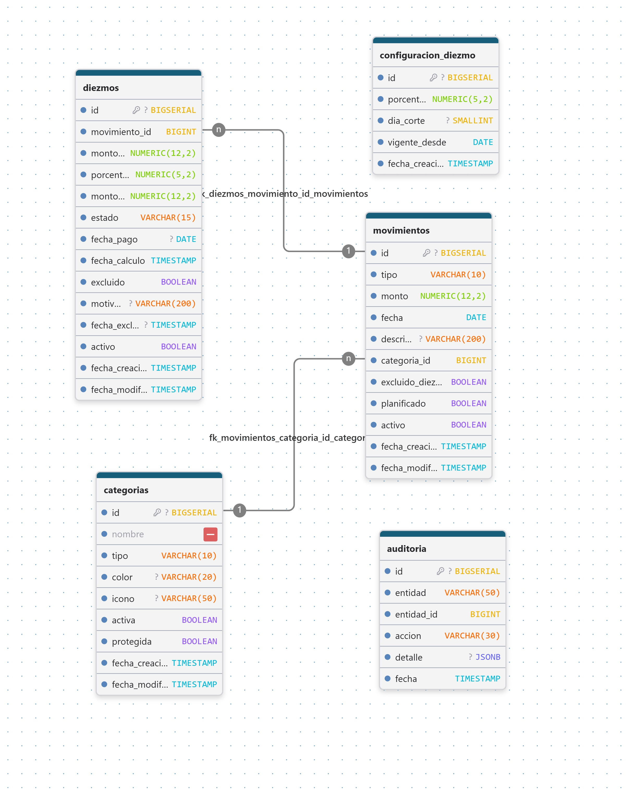

# 💰 Sistema de Finanzas Personales — Backend

> **API REST para el registro y control de finanzas personales:** ingresos, egresos, categorías, cálculo automático del diezmo (10%), reportes mensuales y panel de indicadores.

---

## 📄 Resumen del proyecto

Sistema de uso **personal (single-user, sin autenticación en V1)** cuyo propósito es poner orden en las finanzas del usuario: registrar ingresos y egresos de forma estructurada, **calcular y dar seguimiento al diezmo mensual** para la iglesia, y generar reportes mensuales de gasto por categoría.

Actualmente la gestión se realiza con hojas de cálculo dispersas, lo que genera pérdida de historial, dificultad para saber cuánto se gasta por categoría y — de forma particularmente sensible — el olvido de apartar el diezmo. Este sistema elimina esa problemática centralizando los movimientos y automatizando el cálculo del diezmo en el momento mismo de registrar cada ingreso.

Este repositorio contiene el **backend en Spring Boot**. El frontend estará construido con **Angular** (repositorio aparte).

---

## 🎯 Alcance V1

**Incluido:**
- Registro, edición y borrado lógico de ingresos y egresos.
- Clasificación de movimientos por categorías (ingreso/egreso).
- Cálculo automático del diezmo (10% por defecto, porcentaje configurable).
- Saldo disponible en tiempo real (ingresos − egresos − diezmo apartado).
- Reportes mensuales de gasto por categoría con comparativa mes a mes.
- Dashboard con indicadores principales.
- Auditoría de cambios y trazabilidad (soft delete, timestamps).

**Excluido de V1:**
- Autenticación / multiusuario, sincronización en la nube, múltiples monedas, movimientos recurrentes automáticos, adjuntar comprobantes, integración bancaria.

---

## 📌 Menú de contexto del proyecto

Árbol completo de **módulos y submódulos** del sistema, con enlace a su documento de requerimientos:

- 📁 **Gestión de Movimientos**
  - [Registro de Ingresos y Egresos](Docs/Registro-Ingresos-Egresos-Requerimientos.md) — núcleo operativo: captura, edición, filtros y saldo.
  - [Gestión de Categorías](Docs/Gestion-Categorias-Requerimientos.md) — catálogo de clasificación ingreso/egreso.
- 📁 **Gestión del Diezmo**
  - [Cálculo y Seguimiento del Diezmo](Docs/Calculo-Seguimiento-Diezmo-Requerimientos.md) — cálculo automático, estados pendiente/pagado y acumulado anual.
- 📁 **Gestión de Reportes**
  - [Reportes Mensuales por Categoría](Docs/Reportes-Mensuales-Categoria-Requerimientos.md) — gasto agrupado, porcentajes y comparativa mensual.
- 📁 **Dashboard**
  - [Indicadores Principales](Docs/Indicadores-Principales-Dashboard-Requerimientos.md) — pantalla de entrada: saldo, diezmo pendiente y mayor gasto del mes.
- 🛠️ **Herramientas de documentación**
  - [PromptMaestro.txt](Docs/PromptMaestro.txt) — plantilla maestra para generar nuevos documentos de requerimientos de submódulos.

---

## 🛠️ Stack tecnológico

| Capa | Tecnología |
|------|------------|
| Lenguaje | Java 21 |
| Framework | Spring Boot 4.1.1 |
| Persistencia | Spring Data JPA (Hibernate) + Validación |
| Base de datos | PostgreSQL |
| Migraciones | Flyway |
| Utilidades | Lombok, DevTools |
| Build | Maven (wrapper incluido) |
| Frontend (planeado) | Angular |

---

## ✨ Características principales

1. **Registrar ingresos** — monto, fecha, categoría y descripción.
2. **Registrar egresos/gastos** — con categoría obligatoria y validaciones.
3. **Calcular el diezmo automáticamente** — 10% de cada ingreso, con porcentaje configurable y corte mensual.
4. **Visualizar saldo disponible** — ingresos − egresos − diezmo apartado, en tiempo real.
5. **Generar reportes mensuales por categoría** — totales, porcentajes y comparativa contra el mes anterior.
6. **Consultar indicadores (dashboard)** — saldo, diezmo pendiente/acumulado y categoría con mayor gasto.

---

## 🏗️ Estructura del proyecto

```
src/main/java/com/example/grillo/finanzas_personal/
├── FinanzasPersonalApplication.java
├── common/
│   └── exception/          → ResourceNotFoundException, GlobalExceptionHandler
└── modules/
    ├── shared/enums/       → TipoMovimiento, TipoCategoria
    ├── categorias/         → entity, dto, mapper, repository
    └── movimientos/        → entity, dto, mapper, repository, service,
                              controller, specification
```

Patrón por módulo: `controller → service → repository → entity`, con `dto` para contratos de entrada/salida, `mapper` para transformaciones y `specification` para filtros dinámicos.

---

## 🗄️ Modelo de datos

Migración inicial: [`V1__initial_schema.sql`](src/main/resources/db/migration/V1__initial_schema.sql)

**Tablas:**

| Tabla | Propósito |
|-------|-----------|
| `categorias` | Catálogo de categorías (ingreso/egreso), con color, ícono, activa y protegida |
| `movimientos` | Ingresos y egresos, con soft delete, flag `planificado` y `excluido_diezmo` |
| `configuracion_diezmo` | Histórico versionado de la configuración del diezmo (% y día de corte) |
| `diezmos` | Un registro por ingreso no excluido: base, % congelado, monto, estado PENDIENTE/PAGADO |
| `auditoria` | Trazabilidad de acciones (CREAR, EDITAR, ELIMINAR, MARCAR_PAGADO, …) con detalle JSONB |

**Tipos enumerados:** `tipo_categoria_enum`, `tipo_movimiento_enum`, `estado_diezmo_enum`, `accion_auditoria_enum`.

**Vistas de reportes:**

| Vista | Uso |
|-------|-----|
| `v_resumen_mensual` | Ingresos, egresos y diezmo por mes (dashboard + reportes) |
| `v_reporte_categoria` | Totales y conteo de movimientos por categoría y mes |
| `v_diezmo_mensual` | Diezmo generado / pendiente / pagado por mes |
| `v_diezmo_pendiente_total` | Acumulado de diezmo pendiente de pago |

**Datos semilla:** configuración inicial del diezmo (10%, corte último día del mes) y 8 categorías predefinidas (2 protegidas: *Diezmo y Ofrendas*, *Otros*).

---

## 🔌 API REST

### Movimientos

| Método | Ruta | Descripción |
|--------|------|-------------|
| `POST` | `/api/movimientos` | Registrar un movimiento (ingreso o egreso) → `201` |
| `GET` | `/api/movimientos` | Listado paginado con filtros opcionales |
| `PUT` | `/api/movimientos/{id}` | Editar movimiento (solo mes en curso) |
| `DELETE` | `/api/movimientos/{id}` | Borrado lógico → `204` |

**Parámetros de `GET /api/movimientos`:**

| Parámetro | Tipo | Descripción |
|-----------|------|-------------|
| `fechaInicio` / `fechaFin` | `yyyy-MM-dd` | Rango de fechas |
| `categoriaIds` | `List<Long>` | Filtrar por una o varias categorías |
| `tipo` | `INGRESO` \| `EGRESO` | Filtrar por tipo |
| `page`, `size`, `sort` | — | Paginación (default: 10, `fecha` DESC) |

### Saldo

| Método | Ruta | Descripción |
|--------|------|-------------|
| `GET` | `/api/saldo?periodo=yyyy-MM` | Resumen del mes (default: mes actual) |

**Respuesta:**

```json
{
  "periodo": "2026-10",
  "totalIngresos": 5000.00,
  "totalEgresos": 2300.00,
  "totalDiezmo": 500.00,
  "saldoDisponible": 2200.00
}
```

> Los errores devuelven respuestas consistentes vía `GlobalExceptionHandler` (`404` recurso inexistente, `400` validaciones).

---

## 🖼️ Diagramas

| Diagrama | Vista |
|----------|-------|
|  | Arquitectura general V1 del sistema |
|  | Flujo de datos completo entre módulos |
|  | Modelo de la base de datos |

---

## ▶️ Cómo ejecutar

**Requisitos:**
- JDK 21
- PostgreSQL (local o remoto)
- Maven (o usar el wrapper incluido)

**Pasos:**

1. Crear la base de datos:

   ```sql
   CREATE DATABASE db_finanzas;
   ```

2. Configurar credenciales en [`src/main/resources/application.properties`](src/main/resources/application.properties):

   ```properties
   spring.datasource.url=jdbc:postgresql://localhost:5432/db_finanzas
   spring.datasource.username=postgres
   spring.datasource.password=TU_PASSWORD
   ```

3. Arrancar la aplicación (Flyway crea todo el esquema automáticamente):

   ```bash
   # Linux / macOS
   ./mvnw spring-boot:run

   # Windows
   mvnw.cmd spring-boot:run
   ```

---

## 📊 Estado del proyecto

| Módulo / Submódulo | Estado | Detalle |
|--------------------|--------|---------|
| Gestión de Movimientos → Registro de Ingresos y Egresos | ✅ Implementado | API CRUD + filtros + paginación |
| Gestión de Movimientos → Saldo disponible | ✅ Implementado | `GET /api/saldo` |
| Gestión de Movimientos → Gestión de Categorías | 🔧 En progreso | Entity/DTO/Repository listos, falta API |
| Gestión del Diezmo → Cálculo y Seguimiento | ⏳ Pendiente | BD y requerimientos listos |
| Gestión de Reportes → Reportes Mensuales | ⏳ Pendiente | Vistas SQL listas, falta servicio/API |
| Dashboard → Indicadores Principales | ⏳ Pendiente | Requiere Movimientos, Diezmo y Reportes |
| Frontend Angular | ⏳ Pendiente | Repositorio aparte |

---

## 📚 Documentación

Todos los documentos de requerimientos viven en la carpeta [`Docs/`](Docs/) y están enlazados desde el [menú de contexto](#-menú-de-contexto-del-proyecto).
